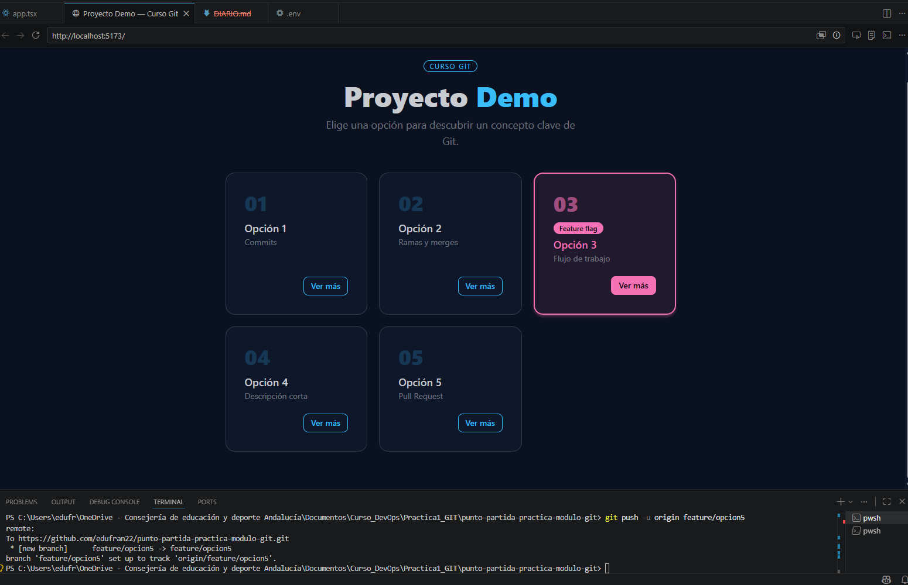

## Tarea 1:
- ¿Qué es un fork? 
   Un fork es una copia personal de un repo de otra persona que se guarda en tu propia cuenta de GitHub en modo "online". Permite experimentar, realizar cambios y proponer mejoras libremente sin afectar el proyecto original.
- ¿Para qué sirve "upstream"?
   "Upstream" hace referencia al repositorio original desde el cual se creó el fork.
 ### Capturas obligatorias

## Tarea 2:
- ¿Por qué la rama parte de dev y no de main?
   La razón principal por la que no partes directamente de main es para proteger la estabilidad del proyecto, en main solo debe haber versiones del código que ya han sido probadas y aprobadas. "Dev" es la rama donde se van juntando todas las carácterísticas nuevas que el equipo está desarrollando y si algo sale mal mientras juntas dos carácterísticas o funciones nuevas, se rompe dev, pero tu versión de producción (main) sigue intacta y funcionando para los clientes.
 ### Capturas obligatorias
 
