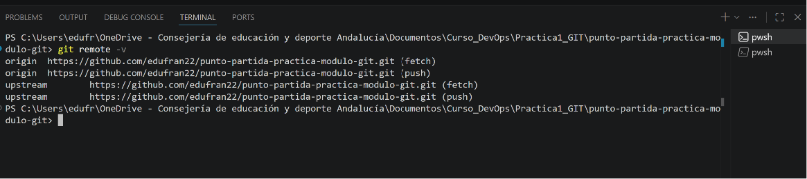
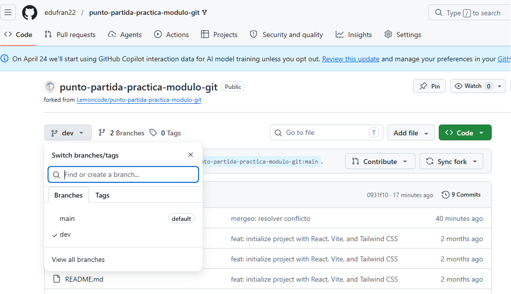

Tarea 1:
- ¿Qué es un fork? 
   Un fork es una copia personal de un repo de otra persona que se guarda en tu propia cuenta de GitHub en modo "online". Permite experimentar, realizar cambios y proponer mejoras libremente sin afectar el proyecto original.
- ¿Para qué sirve "upstream"?
   "Upstream" hace referencia al repositorio original desde el cual se creó el fork.

Tarea 2:
